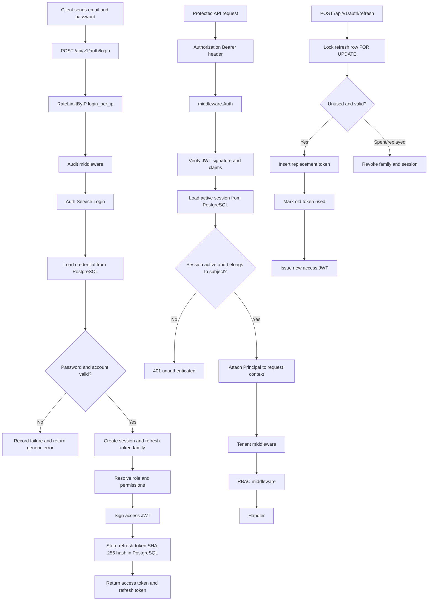

# Authentication and Authorization Runbook

This document describes the authentication implementation in this repository as it exists today. The main implementation is under `internal/modules/auth`, request protection is under `internal/middleware`, and shared Redis/configuration code is under `internal/platform`.

## 1. System Overview

The system uses a hybrid authentication design:

- Access tokens are signed, short-lived JWTs. They carry a snapshot of identity and permissions.
- Refresh tokens are opaque, cryptographically random values. Only their SHA-256 hashes are stored in PostgreSQL.
- A PostgreSQL session row is the stateful authority behind every access token. The session is checked on every authenticated request.
- Redis is used by the rate limiter and by shared platform facilities such as cache, lock, pub/sub, and idempotency key namespaces. Redis is not the source of truth for refresh tokens or sessions.
- Casbin-style RBAC policy is represented by database rows and an in-memory snapshot in `internal/modules/rbac/casbin.go`.

This gives the application JWT speed and portability while retaining immediate server-side revocation through the session record.

## 2. Authentication Flow



## 3. Routes and Middleware

Routes are registered in `internal/modules/auth/routes.go` and mounted below `/api/v1/auth` by the router.

### Public routes

- `POST /api/v1/auth/login`
  - `RateLimitByIP("login_per_ip")`
  - `Audit()`
  - `Handler.Login`
- `POST /api/v1/auth/refresh`
  - `RateLimitByIP("refresh")`
  - `Audit()`
  - `Handler.Refresh`
- `POST /api/v1/auth/password/forgot`
  - `RateLimitByIP("reset")`
  - `Audit()`
  - `Handler.PasswordForgot`
- `POST /api/v1/auth/password/reset`
  - `RateLimitByIP("reset")`
  - `Audit()`
  - `Handler.PasswordReset`

These routes run before an identity exists. They do not use `Auth`, `Tenant`, or RBAC middleware.

### Authenticated self-service routes

- `POST /api/v1/auth/logout`: `Auth`, `Audit`; revokes the current session.
- `POST /api/v1/auth/logout-all`: `Auth`, `Audit`; revokes all sessions for the user.
- `POST /api/v1/auth/password/change`: `Auth`, `Audit`; changes the password and revokes other sessions.
- `GET /api/v1/auth/me`: `Auth`; returns the Principal snapshot.

MFA routes are currently reserved endpoints and return `501 Not Implemented`:

- `POST /api/v1/auth/mfa/setup`
- `POST /api/v1/auth/mfa/verify`
- `POST /api/v1/auth/mfa/disable`

## 4. Access Token

### Type and algorithm

Access tokens are compact JWS JWTs generated manually in `internal/modules/auth/jwt.go` by `Signer.Sign`.

The format is:

```text
base64url(header).base64url(payload).base64url(signature)
```

The signature is:

```text
HMAC-SHA256(secret, base64url(header) + "." + base64url(payload))
```

The implementation uses:

- Type: `JWT`
- Algorithm: `HS256`
- Base64: unpadded base64url, `base64.RawURLEncoding`
- Minimum signing secret: 32 bytes
- Header `kid`: configured key ID, when present

The algorithm is pinned during parsing. Any algorithm other than `HS256` is rejected. This prevents `alg=none` and asymmetric/symmetric algorithm-confusion attacks.

### JWT header

Example shape:

```json
{
  "alg": "HS256",
  "typ": "JWT",
  "kid": "key-2026-07"
}
```

### JWT claims

Claims are defined by `auth.Claims` in `internal/modules/auth/jwt.go`.

| Claim | Meaning |
|---|---|
| `iss` | Issuer from `jwt.issuer`, normally `pharmaciano` |
| `sub` | User UUID |
| `aud` | Audience from `jwt.audience`, normally `pharmaciano-users` |
| `exp` | Expiration time as Unix seconds |
| `nbf` | Not-before time as Unix seconds |
| `iat` | Issued-at time as Unix seconds |
| `jti` | Unique JWT ID generated with `uuid.NewString()` |
| `org` | Organization UUID / Casbin domain |
| `branch` | Branch UUID; empty means organization-wide scope |
| `sid` | PostgreSQL session UUID |
| `role` | Highest-priority resolved role name |
| `perms` | Flattened permission strings such as `users:view` |
| `stage` | User lifecycle stage, such as `verified` |
| `status` | User status, such as `active` |

`Signer.Sign` overwrites `iss`, `aud`, `iat`, `nbf`, and `exp` authoritatively. The caller supplies the identity claims in `Service.mintAccess` in `internal/modules/auth/service.go`.

### Access-token TTL

The configured development/default access-token TTL is 15 minutes:

```yaml
jwt:
  access_token_ttl: 15m
```

The value is loaded by `internal/platform/config`, passed through `auth.New`, and stored in `Signer.accessTTL`. `Signer.Parse` rejects expired tokens. A configured clock-skew allowance is applied when checking `exp` and `nbf`; the default is 30 seconds.

The access token is not automatically added to arbitrary requests by the server. The client must send it on every protected request:

```http
Authorization: Bearer <access_token>
```

`middleware.Auth` in `internal/middleware/auth.go` reads and validates this header. The server then attaches the resulting `Principal` to the Go request context for downstream middleware and handlers.

## 5. Refresh Token

### Format and storage

Refresh tokens are opaque values generated by `generateRefreshToken` in `internal/modules/auth/password.go`:

- 32 cryptographically random bytes from `crypto/rand`
- 256 bits of entropy
- 43 characters when encoded as unpadded base64url
- Safe for JSON and cookies

The raw value is returned to the client once. It is never stored at rest. `hashToken` applies SHA-256 and stores the hexadecimal hash in PostgreSQL `refresh_tokens.token_hash`.

SHA-256 is appropriate here because the token already has 256 bits of random entropy. A slow password KDF is not necessary for this random bearer secret.

### Where it is sent

On login and refresh, the handler:

- Returns `refresh_token` in the JSON response for mobile and server clients.
- Sets the same raw value in the configured HttpOnly refresh cookie for browsers.

The browser cookie is managed by `cookieManager` in `internal/modules/auth/handler.go` and configured through `refresh_cookie` settings. The server never returns the stored hash.

### Refresh rotation

`Service.Refresh` in `internal/modules/auth/service.go` performs rotation in one PostgreSQL transaction:

1. Hash the presented raw refresh token with SHA-256.
2. Find the matching database row and lock it with `FOR UPDATE`.
3. Reject unknown tokens.
4. Reject expired, revoked, or inactive-session tokens and tear down the family when appropriate.
5. Insert a new refresh-token row with the same `family_id` and the session's absolute expiry.
6. Atomically mark the old row as used and link `replaced_by`.
7. Touch the session's activity time.
8. Re-resolve current user status and role/permissions.
9. Mint a new access JWT and return the replacement refresh token.

The session expiry is the hard cap. Rotation does not extend the refresh chain beyond the original session expiry.

### Replay and reuse detection

A refresh token is single-use. Re-presenting a spent token is treated as possible theft:

- All still-live refresh tokens in the family are revoked.
- `reuse_detected_at` is stamped for forensics.
- The owning session is revoked.
- The client receives `TOKEN_REUSE_DETECTED` and must log in again.

The row lock plus the guarded `MarkRefreshTokenUsed` update ensures only one concurrent refresh can win.

### Refresh-token TTL

The default configured TTL is 168 hours (7 days):

```yaml
jwt:
  refresh_token_ttl: 168h
session:
  absolute_timeout: 168h
```

`auth.New` passes the refresh TTL into `ServiceConfig.RefreshTTL`. The first session and first refresh token use the same absolute expiry, and every replacement inherits `session.ExpiresAt`.

The service has a defensive fallback of 30 days when the refresh TTL is unset, but normal validated configuration should provide the explicit value.

## 6. Revocation, Blacklisting, and Logout

### Access-token blacklist status

A Redis key builder exists at `internal/platform/redis/keys.go`:

```text
mc:jwt:blacklist:<jti>
```

However, the current `Authenticate` implementation does not read this key, and logout does not write it. Therefore, there is no active per-JWT Redis blacklist in the current implementation.

Immediate access-token invalidation is achieved through the stateful session check instead:

```text
JWT -> sid -> sessions row -> active/revoked/expired decision
```

### Logout

`POST /api/v1/auth/logout` uses the access token to identify the current `session_id`, then:

- Marks the session `revoked_at`.
- Revokes refresh tokens belonging to that session/family.
- Clears the refresh cookie.

The optional body is:

```json
{
  "all": true
}
```

When `all` is true, the service revokes all sessions and refresh tokens for the user. `POST /logout-all` always performs this all-session operation.

The access JWT may still be cryptographically valid until `exp`, but the next request fails because `Authenticate` sees the revoked session. This is why the session row is the revocation authority.

### Password changes and account changes

Password change keeps the current session alive but revokes the user's other sessions. Password reset, logout-all, user deactivation, and related status changes revoke all affected sessions and refresh tokens. Refresh also re-checks account status before issuing a new pair.

## 7. Authentication Middleware

`middleware.Auth` in `internal/middleware/auth.go` is the authentication middleware.

It performs these steps:

1. Read the `Authorization` request header.
2. Parse the `Bearer <token>` form using `bearerToken`.
3. Call the injected `middleware.Authenticator`, which is `auth.Service.Authenticate`.
4. `Service.Authenticate` calls `Signer.Parse`.
5. Parse user, organization, branch, and session UUID claims.
6. Load the session from PostgreSQL.
7. Confirm the session belongs to the JWT subject and is active.
8. Attach `appctx.Principal` to the request context.
9. Continue to Tenant and RBAC middleware.

A missing header returns `401` with a bearer challenge. Expired access tokens are distinguished so clients know they should try refresh. Other token defects are intentionally reported generically.

## 8. Authorization and Casbin RBAC

The access-control chain is normally:

```text
Auth -> Tenant -> RBAC -> Handler
```

`middleware.RBAC` in `internal/middleware/rbac.go` checks, in order:

1. `SUPER_ADMIN` short-circuit.
2. Permissions embedded in the authenticated Principal.
3. Authoritative in-memory RBAC enforcement through `rbac.Enforcer`.

The RBAC model is in `config/casbin_model.conf`. The database policy source is:

- `roles`
- `permissions`
- `role_permissions`
- `user_roles`

`rbac.Enforcer.Load` builds an in-memory snapshot. It is initially loaded during API startup and periodically reloaded by `StartAutoReload` in `internal/modules/rbac/casbin.go`. Role mutations also reload the snapshot.

The organization UUID is the Casbin domain. A role assignment can be organization-wide or branch-scoped. Permission strings use the `module:action` form, for example `users:view`.

## 9. Redis Usage

Redis is initialized by `internal/platform/redis/client.go` and pinged during API startup. Current authentication-related uses are:

### Rate limiting

`internal/middleware/rate_limit.go` runs an atomic Lua token-bucket script in Redis. Keys are generated by `redis.RateLimitKey`:

```text
mc:rl:<policy>:<subject>
```

The script stores `tokens` and `ts` in a Redis hash and applies a key TTL of twice the configured window. It returns allowed/blocked state, remaining tokens, retry time, and reset time.

### Other platform namespaces

`internal/platform/redis/keys.go` also defines namespaces for:

- Sessions and user sessions
- Refresh tokens and refresh families
- Password reset tokens
- RBAC and catalog caches
- Distributed locks
- Idempotency keys
- Pub/sub event channels

These key builders are available platform infrastructure. The current auth source of truth for sessions and refresh rotation remains PostgreSQL.

### Redis outage behavior

The rate limiter intentionally fails open if Redis is unavailable: the request is logged and allowed to continue. This avoids locking out the entire system during a Redis outage, but it means monitoring must alert on rate-limiter errors.

PostgreSQL/session authentication does not fail open. A database error prevents authentication from succeeding.

## 10. Rate Limiting and Account Lockout

Rate limiting is configured in `config/config.yaml` and implemented by `RateLimit` / `RateLimitByIP` in `internal/middleware/rate_limit.go`.

The limiter is a token bucket:

- Bucket capacity equals `limit`.
- Refill rate is `limit / window` tokens per second.
- One request consumes one token.
- Burst traffic is allowed up to the bucket capacity.
- Blocked responses include rate-limit headers and `Retry-After`.
- A blocked request is aborted with HTTP `429`.

Configured policies:

| Policy | Limit | Window | Current usage |
|---|---:|---:|---|
| `public` | 60 | 1 minute | General public route policy |
| `auth_read` | 300 | 1 minute | Authenticated read routes |
| `auth_write` | 120 | 1 minute | Authenticated write routes |
| `login_per_email` | 5 | 15 minutes | Configured, but not currently attached to the login route |
| `login_per_ip` | 20 | 15 minutes | Current login route policy, per client IP |
| `refresh` | 60 | 1 minute | Refresh route, per client IP |
| `reset` | 3 | 1 hour | Password forgot/reset, per client IP |
| `pos_checkout` | 30 | 1 minute | POS checkout policy |
| `search` | 60 | 1 minute | Search policy |
| `export` | 5 | 1 hour | Export policy |
| `ai` | 20 | 1 hour | AI policy |
| `broadcast` | 10 | 1 minute | Broadcast policy |
| `backup` | 10 | 24 hours | Backup policy |
| `ws_connect` | 10 | 1 minute | WebSocket connection policy |

The login route currently uses `RateLimitByIP("login_per_ip")`, so it limits by IP, not email. The `login_per_email` policy is present in configuration but is not currently applied by `auth/routes.go`.

For policies using `RateLimit`, an authenticated request is keyed by `u:<user_uuid>`. For `RateLimitByIP`, the key is `ip:<client_ip>`. `c.ClientIP()` respects the configured trusted proxy behavior.

### Rate-limit recovery

A rate-limit block is temporary. Tokens refill automatically in Redis. The client should wait for the supplied `Retry-After` seconds or until `X-RateLimit-Reset`, then retry manually or through client retry logic.

The server does not queue or automatically replay a blocked HTTP request. A client library may retry, but it should use bounded retries and backoff rather than immediately repeating the request.

### Account lockout is separate

The login service also applies account-level lockout in `internal/modules/auth/limiter.go`:

- 5 consecutive failed passwords by default.
- Lock duration: 15 minutes.
- Stored in `users.failed_attempts` and `users.locked_until`.
- The counter resets after a successful login.
- It applies regardless of the source IP.
- A locked request returns `ACCOUNT_LOCKED` with retry metadata.

When the lock expires, the server permits a new login attempt. It does not automatically retry the old request; the user/client must submit login again.

## 11. Retry Mechanisms

There are several different retry concepts:

### Refresh rotation retry

There is no automatic client retry for a failed refresh. A replayed refresh token is treated as reuse and revokes the family; the client must perform a fresh login.

### Database transaction serialization retry

`internal/platform/db/transaction.go` supports `WithTxSerialization`:

- Isolation: PostgreSQL `SERIALIZABLE`.
- Retries only on SQLSTATE `40001` serialization failures.
- Maximum configured attempts in the helper: 3.
- Exponential backoff: 50 ms, 100 ms, then 200 ms, capped at 500 ms.

This mechanism is intended for operations such as ledger posting, invoice numbering, and stock decrement. It is not the login refresh retry mechanism, which uses row locks and guarded updates instead.

### RBAC reload retry

`Enforcer.StartAutoReload` reloads immediately and then every 30 seconds by default. A failed reload logs the error and retains the previous snapshot. This is stale-but-safe behavior, not request replay.

### Rate-limit retry

Rate limiting only reports when a retry may succeed. It does not retry the request internally.

## 12. Password Handling

Passwords are not JWT claims and are never returned in API responses.

The shared Argon2id implementation is in `pkg/crypto/password.go`. Login verifies the stored PHC-formatted Argon2id hash. For an unknown email, the service verifies against a dummy Argon2id hash so unknown-email and wrong-password timing is harder to distinguish.

The bootstrap seeder reads `SUPER_ADMIN_INITIAL_PASSWORD`, hashes it with Argon2id, and stores only the hash. The initial super-admin account is marked `must_change_password`.

## 13. Capacity and Efficiency

The design can handle large user populations efficiently when deployed with appropriate PostgreSQL, Redis, and connection-pool sizing:

- JWT signature and claim parsing are in-process and avoid a user/permission query on every request.
- The session lookup is a single indexed PostgreSQL lookup by session UUID on each protected request.
- Permission resolution is embedded in the JWT Principal and backed by an in-memory RBAC snapshot.
- Refresh operations are infrequent compared with normal API requests and use a short transaction with row locking.
- Rate limiting is one atomic Redis Lua operation per limited request.
- PostgreSQL repositories use `pgxpool`; pool sizes and timeouts are configurable.
- The API avoids writing `last_seen_at` on every request and updates session activity during refresh instead.
- Login attempts are append-only audit records and should be monitored/partitioned as volume grows.

This is a sound baseline for high concurrency, but capacity is not automatic. Production sizing should load-test the actual workload and tune:

- `database.pool.max_conns` and PostgreSQL `max_connections`
- Redis memory, latency, and connection pool
- API replica count behind Nginx/load balancer
- PostgreSQL indexes and vacuum/partition maintenance
- request and database timeout values
- login and refresh traffic patterns

A key tradeoff is the PostgreSQL session lookup on every protected request. It provides immediate revocation and is safer than stateless JWT-only validation, but it makes PostgreSQL a hot dependency. Read replicas should not be used for this liveness check because stale replica data could accept a revoked session; the implementation intentionally reads the primary.

## 14. Operational Checks

Check the API and dependency health endpoints:

```text
GET /livez
GET /readyz
GET /healthz
```

Use container logs to confirm:

- `postgres pools ready`
- `redis ready`
- `http server listening`
- `rbac enforcer snapshot loaded`

Useful database checks:

```sql
SELECT id, user_id, expires_at, revoked_at
FROM sessions
ORDER BY created_at DESC;

SELECT id, user_id, family_id, expires_at, used_at, revoked_at,
       reuse_detected_at, replaced_by
FROM refresh_tokens
ORDER BY created_at DESC;

SELECT email, failed_attempts, locked_until, status
FROM users
WHERE email = 'superadmin@pharmaciano.local';
```

## 15. Known Gaps and Important Notes

- `login_per_email` is configured but not currently wired to `POST /auth/login`; login is currently protected by the per-IP bucket plus account-level lockout.
- Redis key builders for JWT blacklisting and refresh-token caching exist, but the active implementation stores and validates sessions/refresh tokens in PostgreSQL.
- MFA endpoints are reserved and currently return `501`.
- The access-token JWT contains a permission snapshot. The session liveness check immediately stops revoked sessions, while role/permission changes are reflected in newly minted tokens and RBAC reloads. Existing access tokens can retain their embedded permission snapshot until they expire, except where the middleware's current Principal/RBAC checks or session revocation prevent access.
- Rate limiting fails open during Redis outages by design. Authentication/session validation does not fail open.
- Never use development fallback secrets in production. Set JWT, encryption, cursor-signing, database, and super-admin values through protected deployment secrets.

## 16. Issuer (`iss`) and Audience (`aud`)

`iss` and `aud` are standard registered JWT claims defined by RFC 7519. They are not decorative labels; they prevent a correctly signed token from one security context being accepted in another.

### `iss`: who issued the token

`iss` means issuer. In this application it is loaded from `jwt.issuer` in `config/config.yaml` and passed by `auth.New` in `internal/modules/auth/module.go` into `SignerConfig.Issuer`.

`Signer.Sign` in `internal/modules/auth/jwt.go` always overwrites the caller's issuer value with the configured issuer. `Signer.Parse` then compares the received `iss` with the configured issuer and rejects a mismatch as `TOKEN_INVALID`.

Example:

```json
{
  "iss": "pharmaciano"
}
```

Why it matters:

- Stops a token issued by another application or environment from being accepted here.
- Separates development, staging, production, or multiple issuer deployments when they use different issuer configuration.
- Makes the trust relationship explicit for services that validate the token.

`iss` does not identify the user. `sub` identifies the user; `iss` identifies the authority that minted the token.

### `aud`: who may consume the token

`aud` means audience. In this application it is loaded from `jwt.audience` and normally configured as `pharmaciano-users`.

`Signer.Sign` stamps it, and `Signer.Parse` requires an exact match. This prevents a token intended for a different API, frontend, worker, or service from being replayed against this API merely because the signing key is shared.

Example:

```json
{
  "aud": "pharmaciano-users"
}
```

In a larger service platform, use distinct audiences such as `pharmaciano-api`, `pharmaciano-admin-api`, and `pharmaciano-worker`, and validate the expected audience at every resource server. Do not treat `iss` or `aud` as authorization roles; they are trust-boundary claims, while RBAC decides what the user may do.

## 17. Why the Access Token Is Not in a Cookie

The current design deliberately places the access token in the login JSON response and expects the client to send it explicitly in:

```http
Authorization: Bearer <access_token>
```

The access token is not set as a cookie by `Handler.Login` in `internal/modules/auth/handler.go`. The refresh token is the value written to the HttpOnly cookie.

This split is useful because:

- Bearer access tokens work for browsers, mobile apps, CLI clients, and service-to-service callers.
- The API does not automatically attach credentials to every browser request.
- Cross-site requests do not automatically receive an access token from a browser cookie.
- Frontends can keep the short-lived access token in memory and refresh it when needed.

There is a tradeoff: JavaScript-managed access tokens can be stolen by a successful XSS attack. The frontend must use a strict Content Security Policy, avoid unsafe HTML insertion, avoid storing access tokens in `localStorage`, and keep the token in memory where practical.

The refresh token is cookie-backed because it is longer-lived and should be protected from ordinary JavaScript using `HttpOnly`. Its cookie should be `Secure` in production, use an appropriate `SameSite` policy, have a narrow `Path`, and be cleared on logout or invalid refresh. Cookie-based refresh endpoints must also be reviewed for CSRF; SameSite is helpful but should not be the only CSRF control for cross-site-capable deployments.

For a browser-only application, a stronger alternative is a Backend-for-Frontend pattern: keep both tokens server-side, issue an opaque HttpOnly session cookie to the browser, and apply CSRF protection to state-changing requests. That removes access-token exposure from browser JavaScript at the cost of a stateful BFF layer.

## 18. Why Redis Does Not Store or Verify Tokens

Redis is optimized for low-latency ephemeral state. The current implementation keeps security-critical session and refresh-token state in PostgreSQL because PostgreSQL provides durable storage, transactions, row locks, foreign keys, auditability, and reliable recovery.

The active division is:

| Data | Current authority | Reason |
|---|---|---|
| JWT signature and claims | API process plus configured secret | Verification is CPU-local and avoids a network round trip |
| Session liveness/revocation | PostgreSQL `sessions` | Durable, transactional, immediately queryable authority |
| Refresh-token hash/state | PostgreSQL `refresh_tokens` | Rotation, `FOR UPDATE`, family revocation, and forensic fields |
| Rate-limit buckets | Redis | Atomic Lua operations and automatic expiry |
| Optional caches/locks/events | Redis platform namespaces | Fast ephemeral coordination, not identity authority |

Putting JWT verification in Redis would add a network dependency to every protected request and would not replace cryptographic verification. Putting only refresh tokens in Redis would make recovery, replication, persistence, and audit semantics depend on Redis configuration. Redis can be used as a carefully designed cache or revocation accelerator, but PostgreSQL remains the current source of truth.

The current cost is one primary PostgreSQL session lookup per authenticated request. This is intentional: a revoked session stops a still-unexpired JWT immediately. A read replica must not be used for this check because replica lag could temporarily accept a revoked session.

## 19. Is There Blacklisting?

There is no active per-access-token blacklist today.

`AccessTokenBlacklistKey` in `internal/platform/redis/keys.go` defines the possible key format:

```text
mc:jwt:blacklist:<jti>
```

But `middleware.Auth`, `Service.Authenticate`, and logout do not read or write that key. The `jti` claim is generated in `Service.mintAccess`, but it is currently for token identity/forensics rather than an active blacklist lookup.

The implemented revocation mechanism is session-based:

```text
access JWT -> sid claim -> PostgreSQL sessions row -> revoked_at / expires_at
```

This is stronger than a purely stateless JWT design for logout and account disablement, but it is not a conventional JWT denylist. If a future blacklist is added, store `jti` with a TTL equal to the remaining access-token lifetime, check it after signature validation, and treat Redis failure conservatively for high-risk operations. Do not let a blacklist become the only durable revocation record.

## 20. Security Assessment

### Current rating: 6.5 / 10

This is a solid custom application authentication baseline, but it is not yet high-end enterprise authentication. It has several good controls: HS256 algorithm pinning, issuer/audience validation, constant-time HMAC comparison, random 256-bit refresh tokens, hashed refresh-token storage, single-use rotation, family reuse detection, PostgreSQL row locking, immediate session revocation, Argon2id passwords, anti-enumeration password verification, account lockout, audit middleware, and tenant-aware RBAC.

The rating is not higher because important production controls are incomplete or operationally fragile. The score assumes the documented development fallback secrets are replaced in production; leaving those defaults enabled would be a critical failure and reduce the practical rating substantially.

### Strengths

1. `Signer.Parse` verifies the signature before trusting claims and pins `HS256`, closing common `alg=none` and algorithm-confusion failures.
2. `iss`, `aud`, `exp`, and `nbf` are checked rather than merely decoded.
3. Refresh tokens have 256 bits of randomness and only SHA-256 hashes are persisted.
4. Refresh rotation is serialized with PostgreSQL `FOR UPDATE` and a guarded update.
5. Reuse detection revokes the entire refresh family and owning session.
6. Access-token replay after logout is stopped by the session lookup.
7. Passwords use Argon2id and unknown-email login performs dummy verification.
8. Tenant and branch scope are represented explicitly and RBAC fails closed when authorization enforcement errors.

### High-priority gaps

#### 1. Hand-rolled JWT implementation

The custom implementation in `internal/modules/auth/jwt.go` is small and tested, but JWT/JWS parsing is security-sensitive protocol code. Future changes can miss edge cases involving claim types, duplicate JSON keys, audience arrays, header validation, Unicode, or interoperability.

Recommended solution: use a mature, maintained JOSE/JWT library with strict algorithm allowlists, typed claim validation, key rotation support, and security advisories. Keep the existing tests, add interoperability tests, and pin the accepted algorithms and issuer/audience explicitly.

#### 2. Symmetric HS256 key sharing

Every service that verifies HS256 needs the same secret. A compromised verifier can mint tokens accepted by every other verifier.

Recommended enterprise solution: use asymmetric signing, normally EdDSA/Ed25519 or RS256 where ecosystem compatibility requires it. Keep the private key only in the authorization server, publish public keys through a JWKS endpoint, include a key ID, support overlapping active/retiring keys, and rotate keys automatically through a KMS/HSM-backed key lifecycle.

#### 3. Permission snapshots can become stale

Permissions are embedded in the access JWT. Revoking a role does not rewrite already issued tokens. Session revocation handles logout, status changes, and explicit session teardown, but a permission change alone can leave an existing active session carrying old permissions until token expiry or reauthentication.

Recommended solutions, in increasing cost:

- Keep access TTL very short and bump a per-user authorization version on role changes; reject tokens with an old version.
- Store an authorization version or policy epoch in the session and compare it on each request.
- Cache permissions server-side with explicit invalidation through Redis pub/sub.
- For highest-risk actions, perform authoritative permission checks instead of relying only on claims.

#### 4. MFA is not implemented

All MFA endpoints currently return `501 Not Implemented`, and the login code intentionally does not enforce `mfa_enabled` yet.

Recommended solution: implement WebAuthn/passkeys as the preferred phishing-resistant factor, with TOTP as a fallback, recovery codes, enrollment confirmation, step-up authentication for sensitive actions, factor reset controls, and audit events. Never log TOTP secrets or recovery codes.

#### 5. Login email rate limit is not wired

`login_per_email` is configured as 5 attempts per 15 minutes, but `auth/routes.go` currently applies only `RateLimitByIP("login_per_ip")`. A distributed attacker can spread attempts across IP addresses against one account.

Recommended solution: apply a privacy-preserving per-account bucket after normalized email parsing, alongside the IP bucket. Keep account lockout, but design it to avoid trivial denial of service against a targeted user; use progressive delays and risk signals rather than only a hard lock where appropriate.

#### 6. Rate limiting fails open on Redis failure

`internal/middleware/rate_limit.go` allows traffic through when Redis is unavailable. This preserves availability but removes brute-force protection during an outage.

Recommended solution: use a tiered policy. Fail closed or apply a local in-process emergency limiter for login, password reset, MFA, and token endpoints; permit lower-risk read traffic with a degraded local budget. Alert immediately when the distributed limiter fails open.

#### 7. Development secrets have insecure fallbacks

Compose currently contains fallback values such as `ChangeMe123!`, a default JWT secret, and a default encryption key. These are acceptable only for disposable local development.

Recommended solution: fail startup in staging/production when secrets are absent or match known development values. Load secrets from a cloud secret manager, Docker/Kubernetes secrets, or an HSM/KMS integration. Rotate the currently exposed values because they must be considered compromised once shared in logs, configuration, or documentation.

#### 8. Refresh token appears in JSON as well as cookie

Returning the refresh token in JSON supports mobile and server clients, but for browser calls it increases exposure to browser JavaScript and accidental logging.

Recommended solution: use separate client profiles. Browser profile: HttpOnly Secure SameSite cookie only, no refresh token in JSON. Native/server profile: return the token in the response and require secure OS/server-side storage. Never log request or response bodies containing tokens.

#### 9. Session lookup is secure but scales through PostgreSQL

The primary DB lookup on every protected request is a deliberate security tradeoff, but very high traffic can make it the bottleneck.

Recommended solution: add a short-lived, revocation-aware session cache in Redis with versioned invalidation, while retaining PostgreSQL as source of truth. On logout/status/role changes, publish invalidation events and delete the cache key. For high-risk routes, require a primary-backed check. Load-test failover, cache stampede, and stale-cache windows before enabling this optimization.

### Medium-priority gaps

- No visible proof-of-possession mechanism such as DPoP or mTLS for high-value APIs; bearer tokens remain replayable if stolen.
- No explicit device binding beyond session metadata and optional fingerprint fields. Device fingerprinting should not be treated as a sole security factor.
- No documented secret/key rotation runbook, JWKS rotation, emergency key revocation procedure, or incident response playbook.
- Password-reset delivery is currently logged/system-driven rather than a fully integrated, abuse-resistant email workflow. Reset tokens need strict redaction, single-use enforcement, short TTL, and delivery monitoring.
- MFA, session management, suspicious-login detection, IP reputation, impossible-travel detection, and step-up policies are incomplete.
- Authorization uses both claim permissions and an enforcer snapshot. The precedence and freshness rules should be made uniform, especially for sensitive operations.
- The system uses an application-local issuer/audience model rather than a full OAuth 2.1/OIDC authorization-server model. That is acceptable for a bounded monolith but not ideal for many external clients or federated enterprise identity.
- Security headers, TLS termination, CORS, cookie domain/path, trusted proxy configuration, and log redaction require environment-specific security tests.

## 21. Recommended Enterprise Target Architecture

For a single product with first-party clients, the strongest practical evolution is:

1. Keep a dedicated authorization/authentication service or BFF as the only JWT issuer.
2. Use OAuth 2.1/OIDC patterns for browser, mobile, and external integrations. Use Authorization Code + PKCE for interactive clients; do not use implicit flow or password grant.
3. Sign access tokens with Ed25519 or RSA keys held by KMS/HSM. Publish a versioned JWKS endpoint and rotate keys with overlap.
4. Use short-lived access tokens, commonly 5 to 10 minutes for high-risk APIs, with audience-specific validation.
5. Keep refresh tokens opaque, single-use, hashed at rest, family-bound, sender-constrained where possible, and rotated on every use.
6. Use HttpOnly Secure SameSite cookies for browser refresh or BFF sessions; keep browser access tokens out of persistent web storage.
7. Implement WebAuthn/passkeys, TOTP fallback, recovery codes, and step-up MFA.
8. Add per-IP, per-account, per-device, and risk-based adaptive rate limits. Keep a local emergency limiter for Redis outages.
9. Add an authorization epoch/version to users or sessions and invalidate it on role, permission, status, password, and organization changes.
10. Cache session and authorization state only with bounded TTL and explicit invalidation; keep PostgreSQL as the durable audit/source-of-truth store.
11. Use centralized audit events with correlation IDs, immutable retention, token/PII redaction, and alerting for reuse detection, repeated failures, privilege changes, and key events.
12. Add security testing: fuzz JWT parsing, dependency scanning, SAST/DAST, integration tests for replay/race conditions, CSRF/XSS tests, load tests, secret-scanning gates, and disaster-recovery exercises.

### Target control profile

| Area | Current | Enterprise target |
|---|---|---|
| Access signing | Hand-rolled HS256 | Mature JOSE library, asymmetric KMS/HSM keys, JWKS |
| Access lifetime | 15 minutes | 5-10 minutes for sensitive APIs, policy-based |
| Revocation | PostgreSQL session check | Session check plus versioned cache/invalidation |
| Refresh | Rotating opaque DB token family | Same, plus sender constraint and browser/client separation |
| MFA | Reserved `501` endpoints | WebAuthn/passkeys, TOTP fallback, recovery and step-up |
| Rate limiting | Redis token bucket, fail-open | Multi-dimensional adaptive limits and emergency local fallback |
| Authorization freshness | JWT permission snapshot | Authorization epoch and authoritative checks for sensitive actions |
| Federation | Local credentials | OIDC/SAML federation where enterprise customers require it |
| Operations | Logs and health endpoints | SIEM, alerting, key rotation, incident response, DR evidence |

## 22. Final Position

The current implementation is materially better than a basic stateless JWT system and is suitable as a development and controlled internal-application baseline after secrets are fixed. It should not yet be marketed as enterprise-grade identity infrastructure because MFA, asymmetric key management, permission freshness, resilient rate limiting, formal client profiles, and operational key/incident controls are incomplete.

The safest upgrade order is: remove default secrets, implement MFA, wire per-account rate limiting, introduce authorization-version invalidation, replace hand-rolled HS256 with a mature asymmetric JOSE/JWKS design, then add Redis session caching and enterprise federation only after load and security testing prove the behavior.
